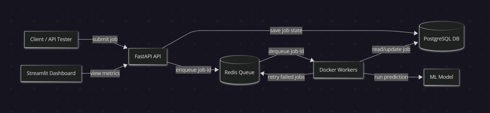

# Distributed AI Inference & Job Scheduling Platform

A backend-first ML inference platform that processes prediction jobs asynchronously using FastAPI, Redis, PostgreSQL, Docker workers, retries, and monitoring.

This project isn't about building the best ML model — it's about building the system around the model: job submission, queueing, worker execution, failure handling, state tracking, and observability.

---

## Why this project exists

A simple ML demo usually looks like this:

```text
request → model → prediction
```

That's not how real inference systems operate under load.

This project was built to handle the backend problems that appear once prediction requests need to be processed reliably:

```text
request → job creation → queue → workers → retry → database state → metrics
```

The goal was to design a small but realistic inference backend where API requests don't block, workers process jobs independently, failures are tracked, and system behavior is visible through metrics.

---

## Architecture



FastAPI accepts prediction jobs. PostgreSQL stores the durable job state. Redis stores lightweight job IDs for workers to consume. Dockerized workers process inference jobs asynchronously. Streamlit displays system metrics from the API.

---

## What's implemented

- FastAPI REST API for submitting and tracking inference jobs
- Redis queue for asynchronous job dispatch
- PostgreSQL job tracking with SQLAlchemy
- 3 Dockerized worker services
- 4 threads per worker using `ThreadPoolExecutor`
- 12 total concurrent worker threads
- Retry handling with up to 3 attempts for failed jobs
- scikit-learn inference model
- Streamlit monitoring dashboard
- Docker Compose setup for API, Redis, PostgreSQL, workers, and dashboard
- Load test with 1,000+ submitted jobs reaching terminal state

---

## System behavior

### Job lifecycle

```text
queued → processing → completed
                  ↘ failed
```

A job is first saved in PostgreSQL. Only the job ID is pushed to Redis. Workers consume job IDs from Redis, fetch job details from PostgreSQL, run inference, and update the final status.

Redis handles queue dispatch. PostgreSQL is the source of truth.

---

### Worker concurrency

```text
3 worker services × 4 threads per worker = 12 concurrent worker threads
```

Each worker runs as a separate Docker service and consumes jobs from the same Redis queue.

---

### Retry handling

Failed jobs are retried up to 3 times. After the retry limit is reached, the job is permanently marked as failed in PostgreSQL, along with the error message.

Verified failed-job example:

```text
status        : failed
retry_count   : 3
error_message : Expected 5 features, got 2
```

---

## Local validation

The platform was verified locally through Docker Compose.

Sample metrics from a verified run:

```text
total_jobs                 : 41
completed_jobs             : 40
failed_jobs                : 1
total_retries               : 3
average_latency_ms         : 18.77
max_latency_ms             : 48.55
throughput_jobs_per_minute : 2.0
success_rate_percent       : 97.56
failure_rate_percent       : 2.44
```

The 1,000+ job load test also completed successfully, with all submitted jobs reaching terminal state.

Proof:

- [Docker services](docs/proof/01-docker-services.txt)
- [API health](docs/proof/02-api-health.json)
- [Redis queue health](docs/proof/03-queue-health.json)
- [Job submission](docs/proof/04-submit-job.json)
- [Completed job](docs/proof/05-completed-job.json)
- [Failed job retry](docs/proof/07-failed-job-retry.json)
- [Metrics summary](docs/proof/08-metrics-summary.json)
- [Recent jobs](docs/proof/09-recent-jobs.json)
- [Worker logs](docs/proof/10-worker1-logs.txt)
- [PostgreSQL job counts](docs/proof/13-postgres-status-count.txt)
- [Failed jobs in PostgreSQL](docs/proof/14-postgres-failed-jobs.txt)
- [Completed jobs in PostgreSQL](docs/proof/15-postgres-completed-jobs.txt)
- [1,000+ load test output](docs/proof/16-load-test-output.txt)
- [Dashboard screenshot](docs/screenshots/02-streamlit-dashboard.png)

---

## API endpoints

| Method | Endpoint | Description |
| --- | --- | --- |
| `GET` | `/health` | API health check |
| `GET` | `/queue/health` | Redis queue health check |
| `POST` | `/jobs` | Submit prediction job |
| `GET` | `/jobs/{job_id}` | Get job status and result |
| `GET` | `/metrics/summary` | System metrics summary |
| `GET` | `/metrics/recent-jobs` | Recent job history |

---

## Tech stack

Python, FastAPI, Redis, PostgreSQL, SQLAlchemy, scikit-learn, Streamlit, Docker, Docker Compose, ThreadPoolExecutor

---

## Run locally

Start all services:

```bash
docker compose up --build
```

API:

```text
http://localhost:8000
```

Dashboard:

```text
http://localhost:8501
```

Stop services:

```bash
docker compose down
```

Clean restart:

```bash
docker compose down -v
docker compose up --build
```

---

## Quick test

Health check:

```powershell
Invoke-RestMethod -Uri "http://localhost:8000/health" -Method GET
```

Submit a job:

```powershell
$body = @{
    features = @(1, 2, 3, 4, 5)
} | ConvertTo-Json

Invoke-RestMethod `
  -Uri "http://localhost:8000/jobs" `
  -Method POST `
  -ContentType "application/json" `
  -Body $body
```

Check metrics:

```powershell
Invoke-RestMethod -Uri "http://localhost:8000/metrics/summary" -Method GET
```

Run load test:

```powershell
python -u scripts/load_test.py 2>&1 | Tee-Object docs/proof/16-load-test-output.txt
```

Expected successful load-test output:

```text
RESULT: PASS - 1,000+ submitted jobs reached terminal state.
```

---

## Project structure

```text
distributed-ai-inference-platform/
├── app/
│   ├── api/
│   ├── core/
│   ├── db/
│   ├── metrics/
│   ├── models/
│   └── workers/
├── dashboard/
├── scripts/
├── docs/
│   ├── proof/
│   └── screenshots/
├── models/
├── Dockerfile
├── docker-compose.yml
├── requirements.txt
└── README.md
```

---

## Next improvements

- Add authentication and rate limiting
- Add structured logs and tracing
- Add a dead-letter queue for permanently failed jobs
- Add model versioning
- Deploy workers with autoscaling